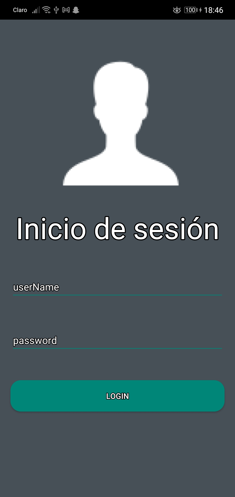
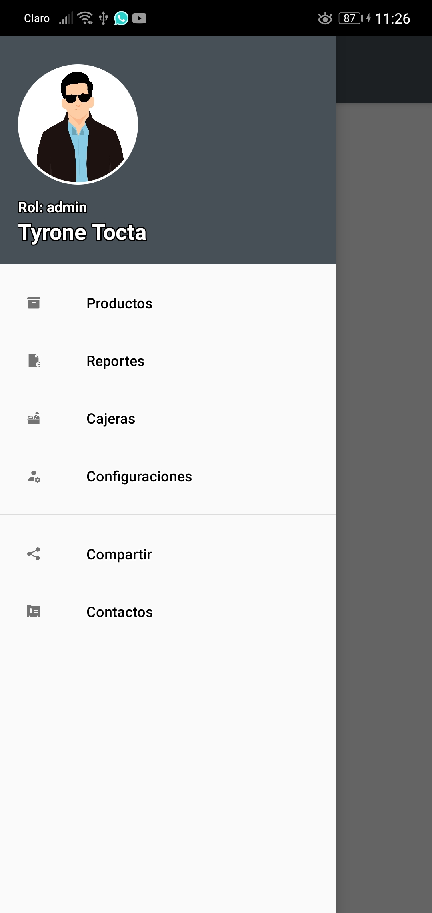
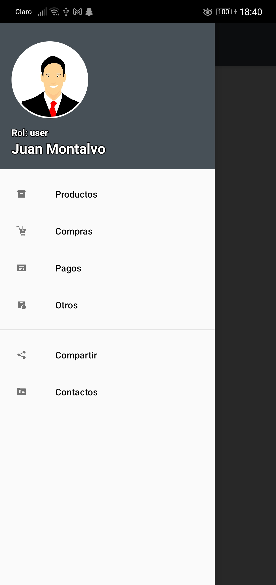
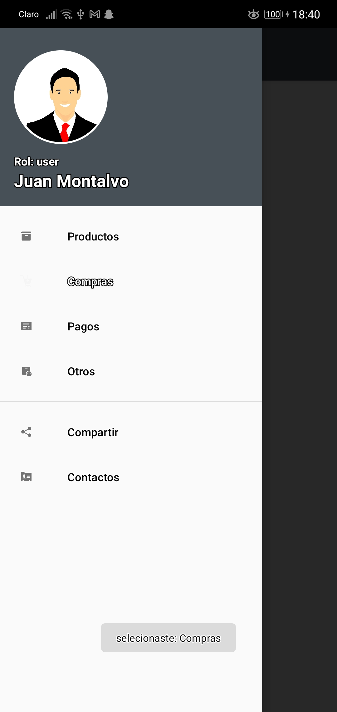

# navigationView
<h1>deber NavigationView</h1>
<h4>credenciales Administrador</h4>
UserName: wladytb
Password: wlady123456
<h4>credenciales Usuario Normal</h4>
UserName: juanC
Password: 123456    
este es el login

el menú es dinámico dependiendo el tipo de usuario por ejemplo en la siguiente imagen se ingresó como admistrador 

el usuario pulsa sobre el item y saldrá una notificacion sobre lo que ha seleccionado, ejemplo:

posteriormente se mostrará el fragmento correspondiente, ejemplo:

en la siguiente imagen se ve un ejemplo si se ha ingresado como usuario normal

seleciona el item y se mostrará un fragmento, ejemplo:

